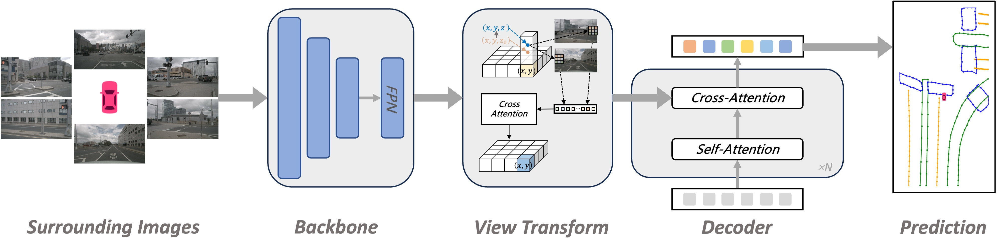
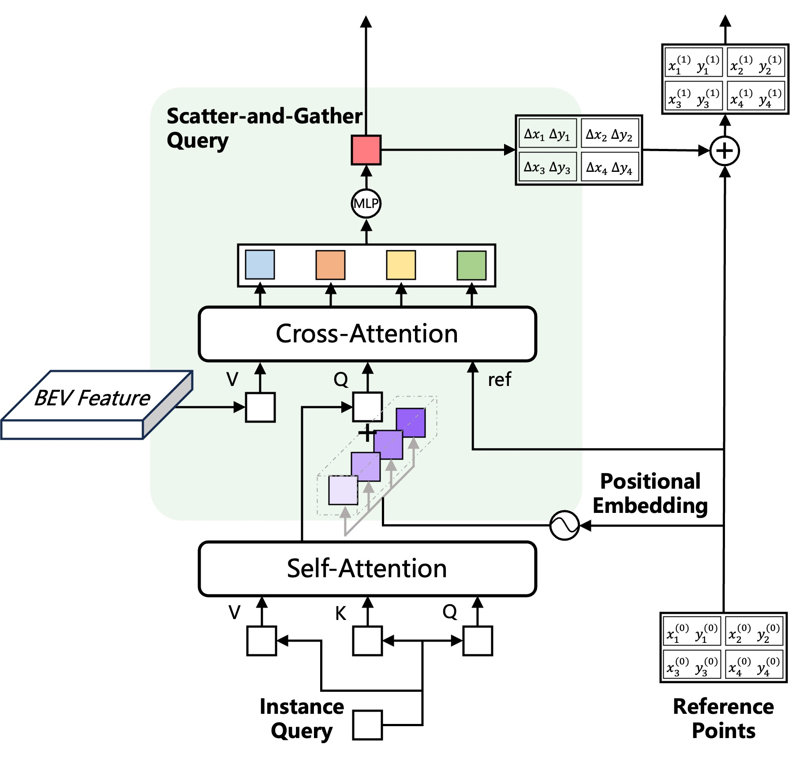

<div align="center">
<h1>MapQR</h1>
<h3>Leveraging Enhanced Queries of Point Sets for Vectorized Map Construction</h3>

Zihao Liu<sup>1*</sup>, 
[Xiaoyu Zhang](https://fishmarch.github.io)<sup>2*</sup>, 
Guangwei Liu<sup>3*</sup>,
[Ji Zhao](https://sites.google.com/site/drjizhao/)<sup>3#</sup>,
[Ningyi Xu](http://www.qingyuan.sjtu.edu.cn/a/xu-ning-yi-1.html)<sup>1#</sup>

<sup>1</sup> Shanghai Jiao Tong University, 
<sup>2</sup> The Chinese University of Hong Kong, 
<sup>3</sup> Huixi Technology

<sup>*</sup>Equal contribution. <sup>#</sup>Corresponding author.

ArXiv Preprint ([arXiv 2402.17430](https://arxiv.org/abs/2402.17430))

Accepted by **ECCV 2024**

</div>

## 🔥 News
- *2024.08*: &nbsp;🎉🎉 Our new work [HRMapNet](https://github.com/HXMap/HRMapNet) is now released, it utilizes historical information to enhance HD map construction!
- *2024.07*: &nbsp;🎉🎉 MapQR is accepted in ECCV 2024! 

## Overview

This project introduces MapQR, an end-to-end method with an emphasis on enhancing query capabilities for constructing online vectorized maps.
Although the map construction is essentially a point set prediction task, MapQR utilizes instance queries rather than point queries. 
These instance queries are scattered for the prediction of point sets and subsequently gathered for the final matching. 
This query design, called the scatter-and-gather query, shares content information in the same map element and avoids possible inconsistency
of content information in point queries. 
We further exploit prior information to enhance an instance query by adding positional information embedded from their reference points. 
Together with a simple and effective improvement of a BEV encoder, the proposed MapQR achieves the best mean average precision (mAP) and maintains good efficiency on both nuScenes and Argoverse 2. 

The main contribution is the proposed scatter-and-gather query, illustrated in the following figure.
<div  align="center"> 

</div>

## Models

#### nuScenes dataset

| Method  | Backbone | Epoch | mAP1 | mAP2 |                         Config                          |                                                                   Download                                                                   |
|:-------:|:--------:|:-----:|:----:|:----:|:-------------------------------------------------------:|:--------------------------------------------------------------------------------------------------------------------------------------------:|
|  MapQR  |   R50    |  24   | 43.3 | 66.4 | [config](projects/configs/mapqr/mapqr_nusc_r50_24ep.py) | [model](https://mycuhk-my.sharepoint.com/:u:/g/personal/1155168294_link_cuhk_edu_hk/EXrwWu0yvz5Ap_aU9FFb4x8BahsKfdFgYW7TgnpsIKho2Q?e=s2CnGT) |
|  MapQR  |   R50    |  110  | 50.5 | 72.6 | [config](projects/configs/mapqr/mapqr_nusc_r50_24ep.py) | [model](https://mycuhk-my.sharepoint.com/:u:/g/personal/1155168294_link_cuhk_edu_hk/EV-zT_ZOIaNEvOCMNuEqjIAB2GnV8HzR-cfskRmdOJcBPQ?e=uOefF4) |

#### Argoverse 2 dataset

| Method  | Backbone | Epoch | dim  | mAP1 | mAP2 |                         Config                          |                                                                   Download                                                                   |
|:-------:|:--------:|:-----:|:----:|:----:|:----:|:-------------------------------------------------------:|:--------------------------------------------------------------------------------------------------------------------------------------------:|
|  MapQR  |   R50    |   6   |  2   | 44.8 | 68.1 | [config](projects/configs/mapqr/mapqr_av2_r50_6ep.py) | [model](https://mycuhk-my.sharepoint.com/:u:/g/personal/1155168294_link_cuhk_edu_hk/EanLLdOtaTZLkE-aKrSy-VcB5Vh4mxfERRtno7qi4efIUg?e=ISTrRn) |
|  MapQR  |   R50    |   6   |  3   | 41.2 | 65.4 | [config](projects/configs/mapqr/mapqr_av2_3d_r50_6ep.py) | [model](https://mycuhk-my.sharepoint.com/:u:/g/personal/1155168294_link_cuhk_edu_hk/EXXCw8AnArtDl7-1lWHh_1ABBwob12MeIfLEzQOPr2MpZg?e=2vXhWl) |


- mAP1 is measured under the thresholds { 0.2, 0.5, 1.0 }
- mAP2 is measured under the thresholds { 0.5, 1.0, 1.5 }

## Getting Started
These settings keep the same as [MapTRv2](https://github.com/hustvl/MapTR/tree/maptrv2)
- [Installation](docs/install.md)
- [Prepare Dataset](docs/prepare_dataset.md)
- [Train and Eval](docs/train_eval.md)
- [Visualization](docs/visualization.md)

### Note
If you meet nan during training, you could comment out this line:
https://github.com/HXMap/MapQR/blob/d05554cffe7a82785570dfec9ed8dc980989d213/projects/mmdet3d_plugin/bevformer/modules/encoder.py#L149

## Acknowledgements

MapQR is mainly based on [MapTRv2](https://github.com/hustvl/MapTR/tree/maptrv2). 

It is also greatly inspired by the following outstanding contributions to the open-source community:
[BEVFormer](https://github.com/fundamentalvision/BEVFormer),
[GKT](https://github.com/hustvl/GKT), 
[ConditionalDETR](https://github.com/Atten4Vis/ConditionalDETR),
[DAB-DETR](https://github.com/IDEA-Research/DAB-DETR).

## Citation
If you find MapQR is useful in your research or applications, 
please consider giving us a star 🌟 and citing it by the following BibTeX entry.
```bibtex
@inproceedings{liu2024leveraging,
  title={Leveraging Enhanced Queries of Point Sets for Vectorized Map Construction},
  author={Liu, Zihao and Zhang, Xiaoyu and Liu, Guangwei and Zhao, Ji and Xu, Ningyi},
  booktitle={European Conference on Computer Vision},
  year={2024}
}
```
